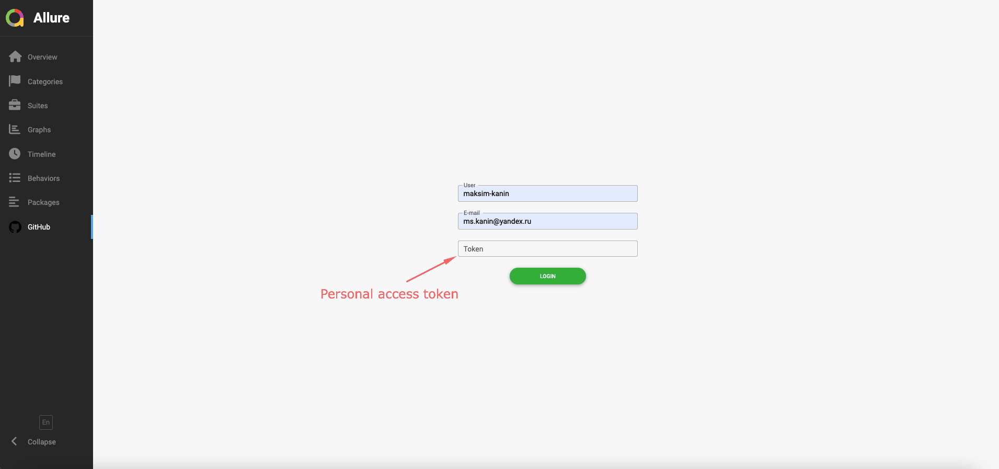
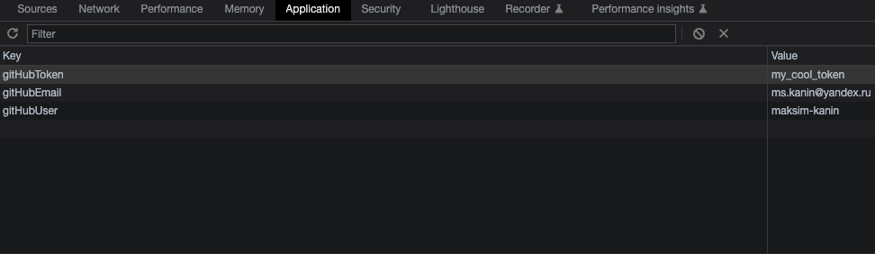
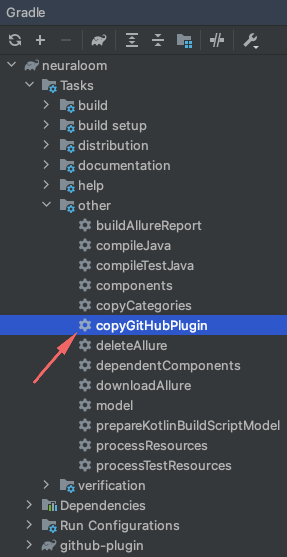
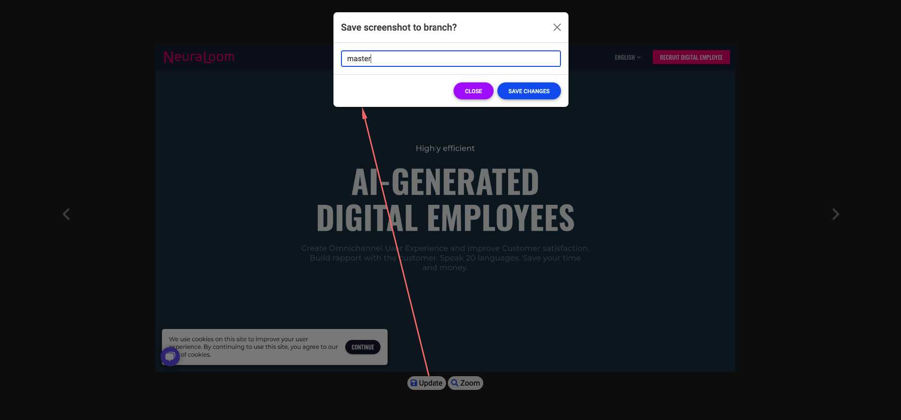
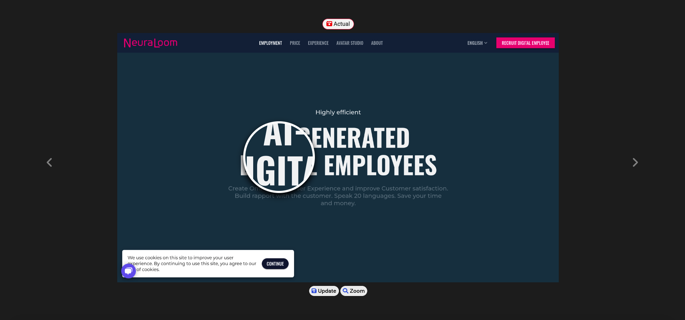

## Neuraloom (https://neuraloom.ai/) screenshot based test project

### Stack:

- 
- 
- 
- 
- [aShot](https://github.com/pazone/ashot) + GitHub plugin

### Setup:

- __rename dev.properties.example__ => __dev.properties__ and specify properties:
  ```properties 
  baseURL=https://neuraloom.ai/
  browser.width=1800
  browser.height=1100
  chrome.version=101
  firefox.version=100
  selenoid.url=http://localhost:4444/wd/hub
  github.owner=maksim-kanin (change it for forked repo)
  github.repo=neuraloom-screenshot-testing (change it for forked repo)
  threads.count=3

### GitHub plugin

- the plugin is used to store information about __user, e-mail and token__ <br>
  
- "LOGIN" adds information to __localStorage__ of a browser:
  
- "LOGOUT" invokes __localStorage.clear()__ method

### GitHub plugin usage

- all resources are located in __github-plugin/src/dist/static__

1. Make some changes
2. Build __github-plugin__ via Gradle
3. Find __github-plugin.tar__ file in __github-plugin/build/distributions__ folder
4. Put the file into the root
5. Execute __copyGitHubPlugin__ task <br>
   
6. Check plugin files are present in __build/allure/commandline/config/allure.yml and build/allure/commandline/plugins__
   folder

### How to write tests

1. Write tests for Chrome and Firefox

```java

@Epic("UI Tests")
@Feature("Main Page")
@Story("Simple tests")
public class MainPageTests {
    @RegisterExtension
    Browser browser = Browser.browser();
    @RegisterExtension
    ScreenshotAssertions assertions = new ScreenshotAssertions(browser);
    NeuraloomUISteps steps = new NeuraloomUISteps(browser);

    @BrowserTest({CHROME, FIREFOX})
    @DisplayName("Open 'https://neuraloom.ai/' and check header")
    void shouldSeeMainPageHeader() {
        steps.openMainPage();
        assertions.compareElement("header", NL.mainPage.mainHeader);
    }

    @BrowserTest({CHROME, FIREFOX})
    @DisplayName("Open 'https://neuraloom.ai/#employment' and check whole page")
    void shouldSeeRealisticAvatarsPage() {
        steps.openMainPage()
                .employment();
        assertions.comparePage("page");
    }
}
```

1.1 Write tests for Chrome only

```java

@Epic("UI Tests")
@Feature("Main Page")
@Story("Simple tests")
public class MainPageTests {
    @RegisterExtension
    Browser browser = Browser.chrome();
    @RegisterExtension
    ScreenshotAssertions assertions = new ScreenshotAssertions(browser);
    NeuraloomUISteps steps = new NeuraloomUISteps(browser);

    @Test
    @DisplayName("Open 'https://neuraloom.ai/' and check header")
    void shouldSeeMainPageHeader() {
        steps.openMainPage();
        assertions.compareElement("header", NL.mainPage.mainHeader);
    }

    @Test
    @DisplayName("Open 'https://neuraloom.ai/#employment' and check whole page")
    void shouldSeeRealisticAvatarsPage() {
        steps.openMainPage()
                .employment();
        assertions.comparePage("page");
    }
}
```

2. Run tests
3. First time you will see an __No reference screenshot found!__ errors
4. Open folders with screenshots (location: __resources/<TEST_METHOD_NAME>/<BROWSER_NAME>/header.png__)
5. Allow Git tracks screenshots (now they are supposed to be __reference__ screenshots)
6. Run tests again (you can see __Screenshot comparison failed! See diff in attachment!__ error in case if comparison
   failed)
7. Execute __buildAllureReport__ task (report location: __build/allure/commandline/bin/report/index.html__)

### Features

#### Save screenshot from __Allure__ on __GitHub__

1. Open __Allure Report__ and fill __GitHub__ tab
2. Open failed test, navigate and click on __Open attachment in new tab__ button
3. Click __Update button__ (if button is disabled come back to 1.)
4. Specify target branch (in my case - __master__ branch) and click __Save changes__ button <br>
   
5. Wait until __Successfully updated!__ popup to be displayed
6. Check a new created __reference__ file in a repo

#### Zoom

1. Click on __Zoom__ button and check small screenshots via a lens <br>
   

### Main classes

#### Aspects

- __ScreenshotAssertionsAspects__ - class interceptor, intercepts screenshot errors

#### Assertions

- __ScreenshotAssertions__ - Junit5 extension for screenshots, contains 2 main methods: __comparePage and compare__

#### Browser

- __Browser__ - Junit5 extension (wrapper) for SelenideDriver
- __BrowserContext and BrowserTest__ - Junit5 Test Template and annotation for __Browser__
- __CustomStrategy__ - custom Junit5 strategy that allows to run tests in several threads

#### Screenshot

- __NoReferenceScreenshotError and ScreenshotDiffError__ - errors classes
- __AttachmentBuilder__ - screenshot builder (based on [FreeMarker](https://freemarker.apache.org/)), writes data in
  __resources/templates/screenshot-template.ftl__ template
- __ScreenShooter__ - __aShot__ wrapper, takes screenshot and throws screenshot errors

### Possible improvements

- GIF file with actual/reference/diff
- ignore specific diff by hash
- store information about updates globally, not in __localStorage__ (for example: Spring-service)
- add ignored areas and show them on click
- soft assertions
- retries